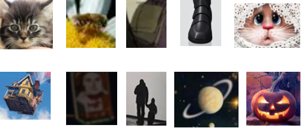

## Теоретическая база

### Прямой поиск одного изображения на другом (template matching)
Прямой поиск одного изображения на другом (template matching) — метод, основанный на нахождении места на изображении, наиболее похожем на шаблон. Этот процесс включает наложение шаблона на исходное изображение и оценку расхождения между ними с использованием различных метрик.

### Поиск ключевых точек эталона на входном изображении (с помощью SIFT)
Метод SIFT (Scale-Invariant Feature Transform) является одним из наиболее эффективных алгоритмов для обнаружения и описания ключевых точек на изображениях. Он широко применяется в задачах компьютерного зрения, таких как распознавание объектов и сопоставление изображений.

Этапы работы алгоритма SIFT:
1. Обнаружение ключевых точек:
    1. Алгоритм начинается с построения пирамиды Гаусса, где изображение последовательно размазывается с использованием гауссовых фильтров различных масштабов. Это позволяет выявить экстремумы (максимумы и минимумы) в пространстве разностей гауссианов, которые служат ключевыми точками.
    2. Ключевые точки выбираются как локальные максимумы в окрестностях, что обеспечивает их устойчивость к шумам и изменениям масштаба.
2. Описание ключевых точек:
    1. Для каждой найденной ключевой точки создается дескриптор, который представляет собой 128-мерный вектор. Этот вектор формируется на основе градиентов изображения в окрестности ключевой точки, разделенной на сектора. Градиенты взвешиваются для уменьшения влияния изменений положения.
    2. Дескрипторы инвариантны к изменениям освещения и масштабированию, что делает их надежными для сопоставления между различными изображениями.
3. Сопоставление ключевых точек:
    1. На этапе сопоставления дескрипторы ключевых точек из эталонного изображения сравниваются с дескрипторами из входного изображения. Для этого используется евклидово расстояние для нахождения наиболее близких соответствий.

## Описание программы

### Прямой поиск одного изображения на другом (template matching)
Поиск реализован в скрипте [template_mathing.py](./template_matching.py)

Поиск наилучшего места осуществляется с помощью функции `template_matching`, на вход в качестве аргументов принимается изображение, в котором надо найти шаблон, и сам шаблон. В качестве метрики расхождения используется MSE.

Описание алгоритма:
1. С помощью циклов происходит проход по картинки окном размера шаблона;
2. Для каждого окна считается ошибка;
3. Находится окно с наименьшей ошибкой и запоминается координаты верхнего левого угла этого окна.
4. Функция возвращает координаты окна с наименьшей ошибкой

Для визуализации найденной области реализована функция `draw_result`. В качестве аргументов она принимает изображение, на котором был осуществлен поиск шаблона, сам шаблон, и путь для сохранения изображения с выделенной областью. Внутри функции вызывается функция `template_matching, и отображается область на изображении.

### Поиск ключевых точек эталона на входном изображении (с помощью SIFT)

## Результаты работы
### Прямой поиск одного изображения на другом (template matching)

Изображения шаблоны приведены ниже:

Изображения, на которых осуществлялся поиск:

Результат работы алгоритма на обрезанных изображениях:

Результат работы алгоритма на измененных изображениях:

Время работы программы:
12.0 минут

### Поиск ключевых точек эталона на входном изображении (с помощью SIFT)

Изображения шаблоны приведены ниже:

Изображения, на которых осуществлялся поиск:

Результат работы алгоритма:
ВСТАВИТЬ!!!!

Время работы программы:
ВСТАВИТЬ!!!!

## Выводы по работе
ВСТАВИТЬ!!!! ПОСЛЕ ТОГО КАК ПОЯВЯТСЯ ГРАФИКИ!!!!!!!

## Использованные источники
1. Документация OpenCV: https://docs.opencv.org/
2. Документация NumPy: https://numpy.org/doc/stable/
3. Статься на Habr про нахождение объектов на картинках: https://habr.com/ru/companies/joom/articles/445354/
